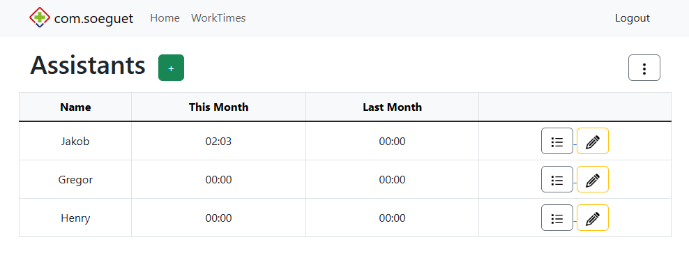

# PartThymeTracker

PartThymeTracker is a comprehensive tool to track and manage working hours for individuals. The primary interface is through an NFC card system that communicates with a server via HTTP POST requests to log hours worked. There is also a web interface for manual entries and overall management. It leverages the power of Spring Boot for the back end and PostgreSQL running on Docker for data persistence.



## Features
1. **NFC Card System**: Each user should be assigned a NFC card with a unique code saved on it. By scanning this card at an NFC-capable device, a HTTP POST request should be sent to the server, logging the timestamp.
2. **Automatic Login/Logout**: The system automatically determines whether the user is logging in or out based on their last action. This simplifies the process for users - all they need to do is scan their card. Audio feedback possible.
3. **Work Duration Feedback**: Upon logout, the server calculates the total work duration for the session and sends this information back. If the NFC device has audio capabilities, this information can be read out loud to the user.
4. **Web Interface**: In addition to the NFC system, a web interface is available for manual entry and management of working hours.

## Technologies

- [JDK 17](https://www.oracle.com/)
- [Gradle 8](https://gradle.org/)
- [Spring Boot 3.1](https://spring.io/projects/spring-boot)
  - [Spring Security 6](https://spring.io/projects/spring-security)
- [Thymeleaf 3.1](https://www.thymeleaf.org/)
- [Bootstrap 5.3](https://getbootstrap.com/)
- [Docker](https://www.docker.com/)
- [NFC](https://de.wikipedia.org/wiki/Near_Field_Communication)
  - A NFC-capable device for testing or any other HTTP client (e.g. Postman)

## Getting Started

These instructions will get you a copy of the project up and running on your local machine for development and testing purposes.

### Installation

1. Clone the repository to your local machine
```bash
git clone https://github.com/soeguet/PartThymeTracker.git
```
2. Navigate to the project directory
```bash
cd PartThymeTracker
```
3. Build the Docker image for PostgreSQL
```bash
./gradlew bootRun
```

Spring Boot 3.1 will start up the docker-compose.yml and start up the PostgreSQL database. The server will be running at [http://localhost:8080](http://localhost:8080).

The pre-set Username is ```user``` and the pre-set password is ```password123```. This user has no admin authority therefore he cannot reach ```/add-user```. If you want to change the authority level, you need to change it in the ```PartThymeTrackerApplication.java``` in the ```run``` method (```new Authority("ROLE_ADMIN")```).

## License

[MIT](https://choosealicense.com/licenses/mit/)

## Contact

If you have any questions, feel free to reach out.

Enjoy tracking with PartThymeTracker!
